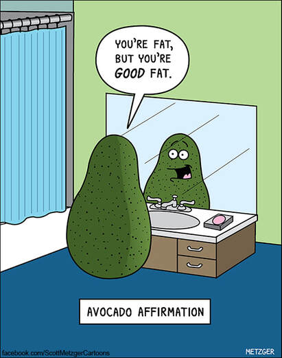
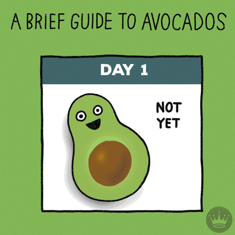
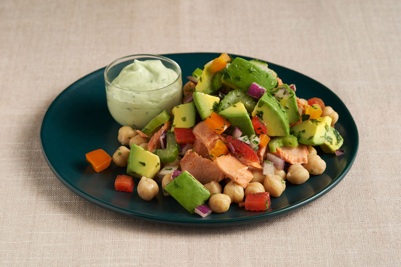

---
output:
  html_document:
    toc: true
    toc_float: true
fontsize: 8pt
---

## Avocado Nutrition Facts

{width=50%}

* Avocados are high in potassium, fiber, and antioxidants.\
* [More nutrition informations...](https://www.medicalnewstoday.com/articles/318620)

## Avocado Fun Facts

{width=50%}

* Avocado is actually a fruit, not a vegetable!\
* Hass avocado is the most famous types of acovado.\
* [More fun facts...](https://facts.net/lifestyle/food/avocado-facts)

## Avocado Recipes

{width=80%}

* [Sunny-Side Up Avocado Burgers](https://www.farmflavor.com/recipes/sunny-side-up-avocado-burgers/)\
* [Avocado Lime Deviled Eggs](https://www.farmflavor.com/recipes/avocado-lime-deviled-eggs/)\
* [Avocado Lemon Ice Cream](https://www.farmflavor.com/recipes/avocado-lemon-ice-cream/)\
* [Grilled Corn, Black Bean and Avocado Salsa](https://www.farmflavor.com/recipes/grilled-corn-black-bean-avocado-salsa/)\
* [More recipes...](https://www.bbcgoodfood.com/recipes/collection/avocado-recipes)
