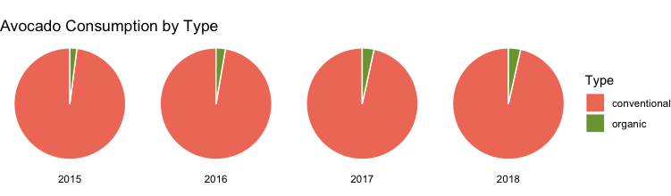

```{r,include=FALSE,message=FALSE,echo=FALSE}
library(tidyverse)
library(ggridges)
library(patchwork)
library(plotly)
library(skimr)
library(rpart)
library(corrplot)
library(tibbletime)
library(lubridate)
library(smooth)
library(grid)
library(gridExtra)
library(magrittr)
library(cowplot)
library(ggthemes)

library(broom)
library(highcharter)
library(rworldmap)
library(gganimate)
library(transformr)
library(corrplot)
library(leaps)
library(kableExtra)

knitr::opts_chunk$set(
  warning = FALSE,
  message = FALSE,
  echo = FALSE)
  theme_set(theme_bw() + 
          theme(legend.position = "bottom",
                legend.title = element_blank(),
                plot.title = element_text(hjust = 0.5, size = 15),
                plot.subtitle = element_text(hjust = 0.5, size = 12)))

avo_df = 
  read_csv("data/avocado.csv") %>% 
  janitor::clean_names() %>% 
  select(-1) %>% 
  separate(date, c("year", "month", "day"), remove = FALSE) %>% 
  mutate(
    year = as.integer(year),
    month = as.integer(month),
    day = as.integer(day)
  ) %>% 
  rename(
    small = x4046,
    large = x4225,
    extra_large = x4770,
  ) 

conv_color = "#F17C67"
org_color = "#7BA23F"
```

## Organic vs. Conventional 
Organic fruit has earned itself a place with people being more and more concerned about life quality. Compared with conventionally farm products, organically grown avocado has lower detectable levels of pesticide residue. Yet, the price is higher as well.

```{r}
# Sort the dates
avo_df <- avo_df[order(as.Date(avo_df$date, format="%Y-%m-%d")),]


price_trend <- 
  avo_df %>% 
  select(date, average_price, type) %>%
  ggplot(aes(x=date, y=average_price, fill=type, color=type)) +
  geom_area(alpha = 0.3, position = position_dodge(0.8)) + 
  theme_minimal() +
  labs(
    title = "Time vs. Avocado Price by Typen",
    x = "Time",
    y = "Average Price",
    fill = "Type"
    #caption = "https://hassavocadoboard.com/"
  ) +
  guides(color = FALSE) + 
  scale_fill_manual(values=c(conv_color, org_color)) +
  scale_color_manual(values=c(conv_color, org_color)) 

price_trend
```

The conventional avocado still takes over the market with lower prices, but the share of organic avocado was increasing slightly year by year.
{}
```{r market_pie_plot, include=FALSE}
avo_df %>% 
  group_by(year, type) %>% 
  summarise(sum_volume = sum(total_volume)) %>%
  ungroup(type) %>% 
  mutate(
    sum_oc = sum(sum_volume),
    percent = paste0(round(sum_volume/sum_oc*100, 1), " %"),
    midpoint = sum_oc - sum_volume / 2
  ) %>% 
  ggplot(aes(x = "", y = sum_volume, fill = type)) +
  geom_bar(stat="identity", position = "fill", width = 1, color = "white") +
  coord_polar("y", start=0) +
  theme_void() + # remove background, grid, numeric labels
  labs(
    fill = "Type"
    ) + 
  scale_fill_manual(values=c(conv_color, org_color)) +
  facet_grid(~year) 
```

## Avocado Price in US over time
We found that across years, the fluctuation of avocado prices was getting greater. Still, a similar pattern could be observed that the prices always peaks around the third quarter of the year. 
```{r price_trend_seasonal}
seasonal_df =  
  avo_df %>% 
  mutate(
    month_year <- format(as.Date(date), "%Y-%m"),
    month <- format(as.Date(date), "%m"),
    format(as.Date(date), "%Y"),
    monthabb = sapply(month, function(x) month.abb[as.numeric(x)]),
    monthabb = factor(monthabb, levels = month.abb)
  )

conv_pat_yearly =
  seasonal_df %>% 
  select(year, monthabb, average_price, type) %>% 
  filter(type == "conventional", year == c("2015", "2016", "2017")) %>%
  group_by(year, monthabb) %>% 
  summarize(avg=mean(average_price)) %>%
  ggplot(aes(x=monthabb, y=avg)) + 
  geom_point(color="#9E7A7A") + 
  geom_line(group=1, color=conv_color) + 
  facet_wrap(~as.factor(year)) + 
  theme_minimal() + 
  theme(plot.title=element_text(hjust=0.5), axis.text.x = element_text(angle = 90)) + 
  labs(title="Seasonal Fluctuations \n Convenctional Avocados", x="Month", y="Average Price")

org_pat_yearly =
  seasonal_df %>% 
  select(year, monthabb, average_price, type) %>% 
  filter(type == "organic", year == c("2015", "2016", "2017")) %>%
  group_by(year, monthabb) %>% 
  summarize(avg=mean(average_price)) %>%
  ggplot(aes(x=monthabb, y=avg)) + 
  geom_point(color="#9E7A7A") + 
  geom_line(group=1, color=org_color) + 
  facet_wrap(~as.factor(year)) + 
  theme_minimal() + 
  theme(plot.title=element_text(hjust=0.5), axis.text.x = element_text(angle = 90)) +
  labs(title="Seasonal Fluctuations \n Convenctional Avocados", x="Month", y="Average Price")

 

plot_grid(conv_pat_yearly, org_pat_yearly, nrow=2)
```

## Relationship between Prices and Total Volume
By visualizing both Price vs. Time and Volume vs. Time, we noticed that the volume **peak** is a signal for an upcoming **drop** in avocado prices.
```{r volume_price}
# filter dataset

organic <- avo_df %>% select(date, average_price, type, total_volume) %>% filter(type == "organic")
conventional <- avo_df %>% select(date, average_price, type, total_volume) %>% filter(type == "conventional")


organic <- as_tbl_time(organic, index=date)
organic <- as_period(organic, '1 month')

conventional <- as_tbl_time(conventional, index=date)
conventional <- as_period(conventional, '1 month')
```

```{r price_volume_plot}
conventional_monthly <- 
  conventional %>%
ggplot(aes(x=date, y=average_price)) + 
  geom_line(color=conv_color) + 
  theme(plot.title=element_text(hjust=0.5)) + 
  labs(title="Conventional Avocados", x= "Time", y="Average Price") + geom_hline(yintercept=max(conventional$average_price), linetype="dashed", color = "red") + 
  geom_hline(yintercept=min(conventional$average_price), linetype="dashed", color = "blue") +
  theme_minimal() 

conventional_volume <- 
  conventional %>%
  ggplot(aes(x=date, y=total_volume)) + 
  geom_bar(stat='identity', fill=conv_color, color=conv_color) + 
  theme(plot.title=element_text(hjust=0.5)) +
  labs(x= "Time", y="Average Volume") +
  geom_smooth(method="loess", color="red") +
  theme_minimal()

organic_monthly <- 
  organic %>% 
  ggplot(aes(x=date, y=average_price)) + 
  geom_line(color=org_color) + 
  theme(plot.title=element_text(hjust=0.5)) + 
  labs(title="Organic Avocados", x= "Time", y="Average Price") + geom_hline(yintercept=max(organic$average_price), linetype="dashed", color = "red") + 
  geom_hline(yintercept=min(organic$average_price), linetype="dashed", color = "blue") +
  theme_minimal()

organic_volume <- 
  organic %>%
  ggplot(aes(x=date, y=total_volume)) + 
  geom_bar(stat='identity', fill=org_color ,color=org_color) + 
  theme(plot.title=element_text(hjust=0.5)) +
  labs(x= "Time", y="Average Volume") +
  geom_smooth(method="loess", color="red") +
  theme_minimal()

plot_grid(conventional_monthly, organic_monthly,conventional_volume, organic_volume, nrow=2, ncol=2)
```

## Avocado Price across Time in US by Region
```{r}
time_fig =
  avo_df %>% 
  filter(year != 2018) %>% 
  group_by(year, month, region) %>% 
  summarise(mean_price = mean(average_price)) %>% 
  ggplot(aes(x = month, y = mean_price, color = region)) +
  geom_point(size = 0.5) +
  geom_smooth(size = 0.3, se = FALSE) + 
  facet_grid(~year) +
  labs(
    title = "Time vs. Avocado Price by Region",
    x = "Month",
    y = "Average Price",
    color = "Region",
    caption = "https://hassavocadoboard.com/"
    ) + 
  scale_x_continuous(
    breaks = c(seq(1, 12, by = 3)),
    labels = c(seq(1, 12, by = 3))
    ) 
  

ggplotly(time_fig) %>% layout(showlegend = FALSE)
```

## Average Year Avocado Consumption in US by Region
We are interested in the ranking of regions people from which consumed the most amount of avocados.

```{r}
avo_df %>% 
  filter(year != 2018 & region != "TotalUS") %>% 
  group_by(region, year) %>%
  summarise(year_sum = sum(total_volume)) %>% 
  ungroup(year) %>% 
  summarise(region_avg = mean(year_sum)) %>% 
  mutate(
    region = fct_reorder(region, region_avg) 
  ) %>% 
  plot_ly(x = ~region, y = ~region_avg, color = ~region, type = "bar") %>%
  layout(
    xaxis = list(title = "Region"),
    yaxis = list(title = "Average Volume Consumption"),
    title = "Region vs. Average Year Consumption"
  ) 
```


